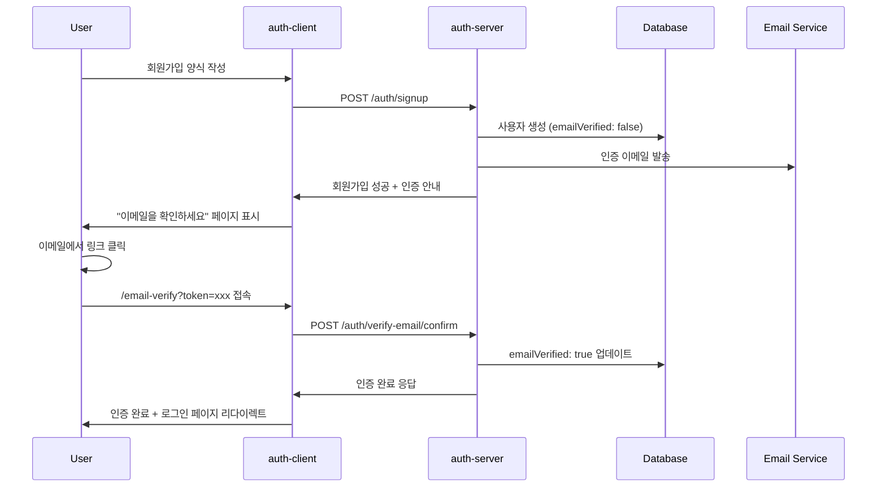
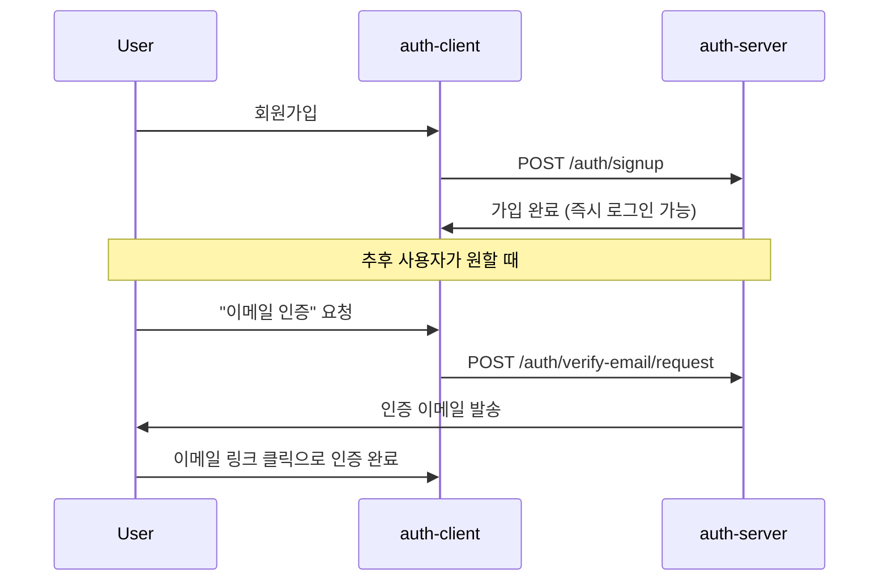

# 이메일 인증 기능 구현 계획서

> **Status**: 계획 단계 (미구현)  
> **Target**: auth-server + auth-client 통합 구현  
> **Priority**: Phase 2 (회원가입/로그인 기본 기능 완료 후 구현)

## 📋 목차

- [현재 상황 분석](#현재-상황-분석)
- [이메일 인증 플로우 설계](#이메일-인증-플로우-설계)
- [auth-server 구현 계획](#auth-server-구현-계획)
- [auth-client 연동 계획](#auth-client-연동-계획)
- [데이터베이스 설계](#데이터베이스-설계)
- [보안 고려사항](#보안-고려사항)
- [구현 우선순위](#구현-우선순위)
- [기술적 세부사항](#기술적-세부사항)

---

## 🔍 현재 상황 분석

### ✅ 구현된 부분
- **auth-client**: 이메일 인증 관련 메서드 준비됨
  - `requestEmailVerification(email: string)`
  - `verifyEmail(token: string)`
  - 관련 타입 정의 완료

### ❌ 미구현 부분
- **auth-server**: 이메일 인증 API 엔드포인트 없음
  - `POST /auth/verify-email/request` 
  - `POST /auth/verify-email/confirm`
- **데이터베이스**: User 테이블에 이메일 인증 필드 없음
- **이메일 발송**: 이메일 발송 인프라 미구축

---

## 🔄 이메일 인증 플로우 설계

### Option 1: 회원가입 필수 인증 (권장)



### Option 2: 선택적 인증



---

## 🛠 auth-server 구현 계획

### 1. 패키지 설치

```bash
npm install nodemailer @types/nodemailer
npm install handlebars  # 이메일 템플릿용
npm install uuid @types/uuid  # 토큰 생성용
```

### 2. API 엔드포인트 구현

#### 🔹 이메일 인증 요청
```typescript
// src/modules/auth/auth.controller.ts
@Post('verify-email/request')
@HttpCode(200)
@SwaggerApiOperation({ summary: '이메일 인증 요청' })
@SwaggerApiBody({ dto: EmailVerificationRequestDto })
async requestEmailVerification(
  @Body() body: EmailVerificationRequestDto,
  @Req() req: Request
): Promise<{ message: string }> {
  await this.authService.requestEmailVerification(body.email, req);
  return { message: '인증 이메일이 발송되었습니다.' };
}
```

#### 🔹 이메일 인증 확인
```typescript
@Post('verify-email/confirm')
@HttpCode(200)
@SwaggerApiOperation({ summary: '이메일 인증 확인' })
@SwaggerApiBody({ dto: EmailVerificationConfirmDto })
async verifyEmail(
  @Body() body: EmailVerificationConfirmDto
): Promise<{ message: string }> {
  await this.authService.verifyEmail(body.token);
  return { message: '이메일 인증이 완료되었습니다.' };
}
```

### 3. 서비스 로직 구현

```typescript
// src/modules/auth/auth.service.ts
import { Injectable, BadRequestException } from '@nestjs/common';
import * as nodemailer from 'nodemailer';
import { v4 as uuid } from 'uuid';

@Injectable()
export class AuthService {
  private emailTransporter: nodemailer.Transporter;

  constructor(
    private readonly userService: UserService,
    private readonly redisService: RedisService,
    private readonly configService: ConfigService,
  ) {
    // 이메일 발송 설정
    this.emailTransporter = nodemailer.createTransporter({
      host: this.configService.get('SMTP_HOST'),
      port: this.configService.get('SMTP_PORT'),
      secure: false,
      auth: {
        user: this.configService.get('SMTP_USER'),
        pass: this.configService.get('SMTP_PASS'),
      },
    });
  }

  async requestEmailVerification(email: string, req?: Request): Promise<void> {
    // 1. 사용자 존재 확인
    const user = await this.userService.findByEmail(email);
    if (!user) {
      throw new BadRequestException('해당 이메일의 사용자를 찾을 수 없습니다.');
    }

    // 2. 이미 인증된 경우 확인
    if (user.emailVerified) {
      throw new BadRequestException('이미 인증된 이메일입니다.');
    }

    // 3. 인증 토큰 생성 및 저장
    const token = uuid();
    const tokenKey = `email_verify:${token}`;
    await this.redisService.set(tokenKey, user.id, 24 * 60 * 60); // 24시간

    // 4. 인증 이메일 발송
    const verificationUrl = `${this.configService.get('AUTH_CLIENT_URL')}/email-verify?token=${token}`;
    
    await this.emailTransporter.sendMail({
      from: this.configService.get('SMTP_FROM'),
      to: email,
      subject: '[krgeobuk] 이메일 인증을 완료해주세요',
      html: this.generateVerificationEmailTemplate(user.name, verificationUrl),
    });

    this.logger.log(`이메일 인증 요청 발송 완료: ${email}`);
  }

  async verifyEmail(token: string): Promise<void> {
    // 1. 토큰 검증
    const tokenKey = `email_verify:${token}`;
    const userId = await this.redisService.get(tokenKey);
    
    if (!userId) {
      throw new BadRequestException('유효하지 않거나 만료된 인증 토큰입니다.');
    }

    // 2. 사용자 이메일 인증 상태 업데이트
    await this.userService.updateEmailVerification(userId, true);

    // 3. 토큰 삭제 (일회성 사용)
    await this.redisService.delete(tokenKey);

    this.logger.log(`이메일 인증 완료: userId=${userId}`);
  }

  private generateVerificationEmailTemplate(userName: string, verificationUrl: string): string {
    return `
    <!DOCTYPE html>
    <html>
    <head>
        <meta charset="utf-8">
        <title>이메일 인증</title>
    </head>
    <body style="font-family: Arial, sans-serif; line-height: 1.6; color: #333;">
        <div style="max-width: 600px; margin: 0 auto; padding: 20px;">
            <h1 style="color: #4F46E5;">krgeobuk 이메일 인증</h1>
            
            <p>안녕하세요, ${userName}님!</p>
            
            <p>krgeobuk 서비스 가입을 환영합니다. 아래 버튼을 클릭하여 이메일 인증을 완료해주세요.</p>
            
            <div style="text-align: center; margin: 30px 0;">
                <a href="${verificationUrl}" 
                   style="background-color: #4F46E5; color: white; padding: 12px 30px; text-decoration: none; border-radius: 5px; display: inline-block;">
                    이메일 인증하기
                </a>
            </div>
            
            <p style="font-size: 14px; color: #666;">
                만약 버튼이 작동하지 않는다면, 다음 링크를 복사하여 브라우저에 붙여넣으세요:<br>
                <a href="${verificationUrl}">${verificationUrl}</a>
            </p>
            
            <p style="font-size: 12px; color: #999; margin-top: 30px; border-top: 1px solid #eee; padding-top: 20px;">
                이 링크는 24시간 후 만료됩니다. 본인이 요청하지 않았다면 이 이메일을 무시하세요.
            </p>
        </div>
    </body>
    </html>
    `;
  }
}
```

### 4. DTO 정의

```typescript
// src/modules/auth/dtos/email-verification.dto.ts
import { IsEmail, IsString, IsNotEmpty } from 'class-validator';
import { ApiProperty } from '@nestjs/swagger';

export class EmailVerificationRequestDto {
  @ApiProperty({ example: 'user@example.com' })
  @IsEmail({}, { message: '올바른 이메일 형식을 입력해주세요.' })
  email: string;
}

export class EmailVerificationConfirmDto {
  @ApiProperty({ example: 'uuid-token-string' })
  @IsString()
  @IsNotEmpty({ message: '인증 토큰은 필수입니다.' })
  token: string;
}
```

---

## 🎨 auth-client 연동 계획

### 1. 이메일 인증 페이지 추가

```typescript
// src/app/email-verify/page.tsx
'use client';

import React, { useState, useEffect, Suspense } from 'react';
import Link from 'next/link';
import { useRouter, useSearchParams } from 'next/navigation';
import { authService } from '@/services/authService';

function EmailVerifyPageContent(): React.JSX.Element {
  const [status, setStatus] = useState<'loading' | 'success' | 'error'>('loading');
  const [message, setMessage] = useState('');
  
  const router = useRouter();
  const searchParams = useSearchParams();

  useEffect(() => {
    const verifyEmail = async () => {
      const token = searchParams.get('token');
      
      if (!token) {
        setStatus('error');
        setMessage('유효하지 않은 인증 링크입니다.');
        return;
      }

      try {
        const response = await authService.verifyEmail(token);
        setStatus('success');
        setMessage(response.message);
        
        // 3초 후 로그인 페이지로 리다이렉트
        setTimeout(() => {
          router.push('/login');
        }, 3000);
        
      } catch (error) {
        setStatus('error');
        setMessage(error.message || '이메일 인증 중 오류가 발생했습니다.');
      }
    };

    verifyEmail();
  }, [searchParams, router]);

  return (
    <div className="min-h-screen bg-gradient-to-br from-blue-50 via-indigo-50 to-purple-50 flex items-center justify-center py-12 px-4">
      <div className="max-w-md w-full space-y-8">
        <div className="bg-white/90 backdrop-blur-sm rounded-2xl shadow-xl border border-white/30 p-8">
          <div className="text-center space-y-4">
            {status === 'loading' && (
              <>
                <div className="w-16 h-16 mx-auto bg-blue-100 rounded-full flex items-center justify-center">
                  <div className="animate-spin rounded-full h-8 w-8 border-b-2 border-blue-600"></div>
                </div>
                <h2 className="text-2xl font-bold text-gray-700">이메일 인증 중...</h2>
              </>
            )}
            
            {status === 'success' && (
              <>
                <div className="w-16 h-16 mx-auto bg-green-100 rounded-full flex items-center justify-center">
                  <svg className="w-8 h-8 text-green-600" fill="none" stroke="currentColor" viewBox="0 0 24 24">
                    <path strokeLinecap="round" strokeLinejoin="round" strokeWidth={2} d="M5 13l4 4L19 7" />
                  </svg>
                </div>
                <h2 className="text-2xl font-bold text-gray-700">인증 완료!</h2>
                <p className="text-gray-500">{message}</p>
                <p className="text-sm text-gray-400">곧 로그인 페이지로 이동합니다...</p>
              </>
            )}
            
            {status === 'error' && (
              <>
                <div className="w-16 h-16 mx-auto bg-red-100 rounded-full flex items-center justify-center">
                  <svg className="w-8 h-8 text-red-600" fill="none" stroke="currentColor" viewBox="0 0 24 24">
                    <path strokeLinecap="round" strokeLinejoin="round" strokeWidth={2} d="M6 18L18 6M6 6l12 12" />
                  </svg>
                </div>
                <h2 className="text-2xl font-bold text-gray-700">인증 실패</h2>
                <p className="text-gray-500">{message}</p>
                
                <div className="pt-4 space-y-2">
                  <Link href="/login" className="text-blue-500 hover:text-blue-400 font-medium transition-colors block">
                    로그인 페이지로 이동
                  </Link>
                  <button 
                    onClick={() => window.location.reload()}
                    className="text-gray-500 hover:text-gray-400 text-sm transition-colors"
                  >
                    다시 시도하기
                  </button>
                </div>
              </>
            )}
          </div>
        </div>
      </div>
    </div>
  );
}

export default function EmailVerifyPage(): React.JSX.Element {
  return (
    <Suspense fallback={<div>Loading...</div>}>
      <EmailVerifyPageContent />
    </Suspense>
  );
}
```

### 2. 회원가입 완료 페이지 개선

```typescript
// 회원가입 성공 후 표시할 이메일 인증 안내
const SignupSuccessMessage = () => (
  <div className="bg-blue-50 border border-blue-200 rounded-lg p-4 mb-4">
    <div className="flex items-center">
      <svg className="w-5 h-5 text-blue-600 mr-2" fill="none" stroke="currentColor" viewBox="0 0 24 24">
        <path strokeLinecap="round" strokeLinejoin="round" strokeWidth={2} d="M3 8l7.89 5.26a2 2 0 002.22 0L21 8M5 19h14a2 2 0 002-2V7a2 2 0 00-2-2H5a2 2 0 00-2 2v10a2 2 0 002 2z" />
      </svg>
      <h3 className="text-blue-800 font-medium">이메일을 확인하세요</h3>
    </div>
    <p className="text-blue-700 text-sm mt-2">
      회원가입이 완료되었습니다! 이메일 인증을 위해 <strong>{email}</strong>로 발송된 
      인증 링크를 클릭해주세요.
    </p>
    <p className="text-blue-600 text-xs mt-1">
      이메일을 받지 못하셨다면 스팸 폴더를 확인해주세요.
    </p>
  </div>
);
```

---

## 🗄 데이터베이스 설계

### User 테이블 확장

```sql
-- 기존 User 테이블에 이메일 인증 관련 컬럼 추가
ALTER TABLE user ADD COLUMN email_verified BOOLEAN DEFAULT FALSE;
ALTER TABLE user ADD COLUMN email_verified_at TIMESTAMP NULL DEFAULT NULL;

-- 인덱스 추가 (이메일 인증 상태로 조회할 경우를 대비)
CREATE INDEX idx_user_email_verified ON user (email_verified);
```

### User Entity 업데이트

```typescript
// src/modules/user/entities/user.entity.ts
import { Entity, Column, CreateDateColumn, UpdateDateColumn, PrimaryColumn } from 'typeorm';

@Entity('user')
export class UserEntity {
  @PrimaryColumn('varchar', { length: 36 })
  id: string;

  @Column({ type: 'varchar', length: 255, unique: true })
  email: string;

  @Column({ type: 'varchar', length: 255 })
  name: string;

  @Column({ type: 'varchar', length: 255, nullable: true })
  password?: string;

  // 새로 추가되는 이메일 인증 관련 필드
  @Column({ 
    name: 'email_verified', 
    type: 'boolean', 
    default: false 
  })
  emailVerified: boolean;

  @Column({ 
    name: 'email_verified_at', 
    type: 'timestamp', 
    nullable: true 
  })
  emailVerifiedAt?: Date;

  @CreateDateColumn({ name: 'created_at' })
  createdAt: Date;

  @UpdateDateColumn({ name: 'updated_at' })
  updatedAt: Date;
}
```

---

## 🔒 보안 고려사항

### 1. 토큰 보안
- **토큰 형식**: UUID v4 사용 (예측 불가능)
- **만료 시간**: 24시간 (충분히 길되 보안상 제한)
- **일회성 사용**: 토큰 사용 후 즉시 삭제
- **저장 위치**: Redis (메모리 기반, 자동 만료)

### 2. Rate Limiting
```typescript
// 이메일 인증 요청 제한 (1분에 1회)
@UseGuards(ThrottlerGuard)
@Throttle(1, 60)
@Post('verify-email/request')
async requestEmailVerification() {
  // ...
}
```

### 3. 스팸 방지
- 동일 이메일로 24시간 내 최대 3회 요청 제한
- 이미 인증된 이메일 재인증 방지
- Honeypot 기법 적용 (봇 차단)

### 4. 이메일 보안
- HTTPS 강제 (인증 링크)
- SPF, DKIM 설정 (이메일 신뢰성)
- 이메일 내용 최소화 (개인정보 노출 방지)

---

## 📅 구현 우선순위

### Phase 1: 기본 기능 (필수)
1. **auth-server API 구현**
   - `/auth/verify-email/request` 엔드포인트
   - `/auth/verify-email/confirm` 엔드포인트
   - 기본 이메일 발송 기능

2. **데이터베이스 스키마 업데이트**
   - User 테이블에 `email_verified` 필드 추가
   - 마이그레이션 스크립트 작성

3. **auth-client 연동**
   - `/email-verify` 페이지 구현
   - 기존 서비스 메서드 활용

### Phase 2: 개선 사항 (권장)
1. **회원가입 플로우 통합**
   - 회원가입 시 자동 이메일 발송
   - 미인증 사용자 로그인 제한 또는 안내

2. **사용자 경험 개선**
   - 이메일 템플릿 디자인 개선
   - 재발송 기능 추가
   - 인증 상태 표시

### Phase 3: 고급 기능 (선택)
1. **관리자 기능**
   - 사용자 이메일 인증 상태 관리
   - 대량 이메일 발송 도구

2. **모니터링 및 분석**
   - 이메일 발송 성공률 추적
   - 인증 완료율 분석

---

## ⚙️ 기술적 세부사항

### 환경 변수 설정

```bash
# .env.local
# SMTP 설정
SMTP_HOST=smtp.gmail.com
SMTP_PORT=587
SMTP_USER=your-email@gmail.com
SMTP_PASS=your-app-password
SMTP_FROM="krgeobuk <noreply@krgeobuk.com>"

# 이메일 인증 설정
EMAIL_VERIFICATION_EXPIRES=86400  # 24시간 (초)
EMAIL_VERIFICATION_MAX_ATTEMPTS=3  # 최대 시도 횟수
```

### 필요한 의존성

```json
{
  "dependencies": {
    "nodemailer": "^6.9.0",
    "handlebars": "^4.7.7",
    "uuid": "^9.0.0"
  },
  "devDependencies": {
    "@types/nodemailer": "^6.4.7",
    "@types/uuid": "^9.0.0"
  }
}
```

### Redis 키 네이밍 규칙

```typescript
// Redis 키 패턴
const EMAIL_VERIFICATION_PREFIX = 'email_verify:';
const EMAIL_RATE_LIMIT_PREFIX = 'email_rate:';

// 사용 예시
const verificationKey = `${EMAIL_VERIFICATION_PREFIX}${token}`;
const rateLimitKey = `${EMAIL_RATE_LIMIT_PREFIX}${email}`;
```

### 테스트 케이스 예시

```typescript
// __tests__/email-verification.e2e.spec.ts
describe('Email Verification E2E', () => {
  it('should send verification email successfully', async () => {
    const response = await request(app.getHttpServer())
      .post('/auth/verify-email/request')
      .send({ email: 'test@example.com' })
      .expect(200);

    expect(response.body.message).toBe('인증 이메일이 발송되었습니다.');
  });

  it('should verify email with valid token', async () => {
    // 토큰 생성 및 Redis 저장
    const token = uuid();
    await redisService.set(`email_verify:${token}`, 'user-id', 3600);

    const response = await request(app.getHttpServer())
      .post('/auth/verify-email/confirm')
      .send({ token })
      .expect(200);

    expect(response.body.message).toBe('이메일 인증이 완료되었습니다.');
  });
});
```

---

## 📝 추가 참고사항

### 대안 구현 방식
1. **서드파티 이메일 서비스**: SendGrid, AWS SES, Mailgun 활용
2. **이메일 큐 시스템**: Bull Queue를 활용한 비동기 이메일 발송
3. **다중 이메일 제공자**: 주 서비스 실패시 백업 서비스 사용

### 확장 가능성
1. **SMS 인증**: 이메일과 함께 SMS 인증 옵션 제공
2. **2FA 통합**: TOTP와 연계한 2단계 인증
3. **소셜 로그인 연동**: 소셜 로그인시 이메일 자동 인증 처리

### 성능 고려사항
1. **이메일 발송 비동기 처리**: 사용자 응답 속도 향상
2. **Redis 클러스터링**: 대용량 토큰 저장 대비
3. **이메일 템플릿 캐싱**: 템플릿 렌더링 성능 향상

---

**문서 작성일**: 2025-08-08  
**최종 수정일**: 2025-08-08  
**작성자**: Claude Code Assistant  
**버전**: 1.0.0