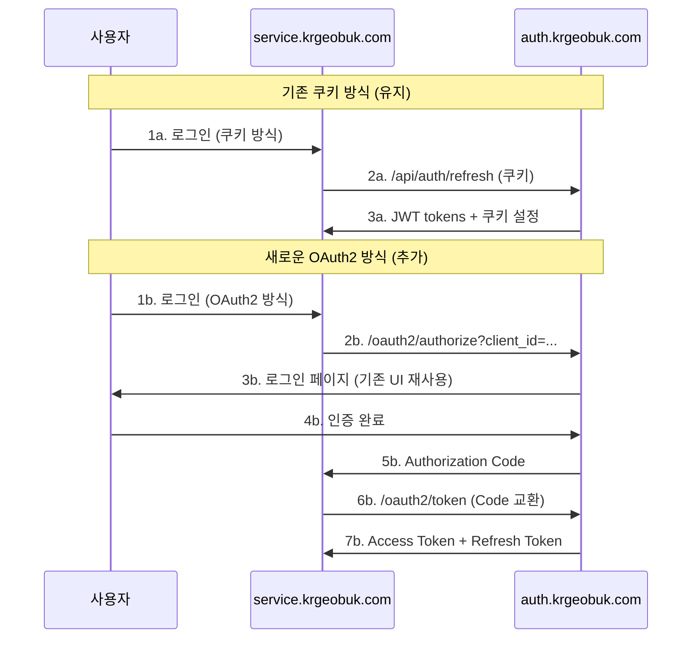

# OAuth2 다중 도메인 확장 계획

## 📋 개요

이 문서는 현재 krgeobuk 인증 시스템을 OAuth2 표준 기반의 다중 도메인 지원 시스템으로 단계적 확장하는 계획을 제시합니다.

## 🎯 현재 상태 (1단계 완료)

### ✅ 서브도메인 최적화 완료 항목

1. **쿠키 설정 최적화**
   - `sameSite: 'none'` (모든 환경) 적용으로 크로스 포트/도메인 POST 요청 지원
   - `secure: true` (프로덕션) / `false` (개발) 환경별 설정
   - 환경별 동적 도메인 설정 (`domain: '.krgeobuk.com'`)
   - 로컬 개발환경에서 다른 포트 간 쿠키 전달 지원

2. **보안 강화**
   - Origin 검증 가드 추가 (`OriginValidationGuard`)
   - Rate Limiting 적용 (1초에 2번 제한)
   - CORS 기반 허용 도메인 검증

3. **환경 변수 추가**
   ```bash
   JWT_COOKIE_DOMAIN=.krgeobuk.com
   JWT_COOKIE_DOMAIN_DEV=
   ```

### 🔧 적용된 기술적 변경사항

```typescript
// JWT 쿠키 설정 최적화 (수정됨)
res.cookie(refreshTokenStore, refreshToken, {
  httpOnly: true,
  secure: mode === 'production', // 로컬 환경에서는 false 허용
  sameSite: 'none', // 모든 환경에서 크로스 사이트 요청 지원 (Origin 검증으로 CSRF 보호)
  domain: mode === 'production' ? cookieDomain : cookieDomainDev,
  path: cookiePath,
  maxAge: refreshMaxAge
});

// 보안 가드 적용
@UseGuards(ThrottlerGuard, RefreshTokenGuard, OriginValidationGuard)
@Throttle({ short: { ttl: 1000, limit: 2 } })
```

### 🔒 **중요: SameSite=none 보안 고려사항**

#### 적용된 보안 조치
- **Origin 검증**: `OriginValidationGuard`로 허용된 도메인에서만 요청 허용
- **Rate Limiting**: 1초에 2번으로 토큰 리프레시 제한
- **CORS 설정**: 환경 변수로 허용 도메인 명시적 관리

#### 브라우저 정책 준수
- **로컬 개발**: `secure: false` + `sameSite: 'none'` (브라우저 예외 허용)
- **프로덕션**: `secure: true` + `sameSite: 'none'` (HTTPS 필수)

#### CSRF 보호 전략
SameSite=none 사용으로 인한 CSRF 위험을 다음으로 완화:
1. **Origin/Referer 헤더 강제 검증** ✅ 구현됨
2. **허용 도메인 화이트리스트** ✅ 구현됨  
3. **요청 빈도 제한** ✅ 구현됨

## 🚀 2단계: OAuth2 병행 운영 (3-6개월 후)

### 목표
기존 쿠키 기반 인증을 유지하면서 OAuth2 Authorization Server 기능을 추가하여 점진적 전환을 준비합니다.

### 구현 계획

#### 1. OAuth2 Authorization Server 구축

```typescript
// oauth2.controller.ts
@Controller('oauth2')
export class OAuth2Controller {
  @Get('authorize')
  async authorize(
    @Query('client_id') clientId: string,
    @Query('redirect_uri') redirectUri: string,
    @Query('response_type') responseType: string,
    @Query('scope') scope: string,
    @Query('state') state: string,
    @Query('code_challenge') codeChallenge?: string,
    @Query('code_challenge_method') codeChallengeMethod?: string
  ): Promise<void> {
    // Authorization Code Flow 시작
  }

  @Post('token')
  async token(
    @Body('grant_type') grantType: string,
    @Body('code') code: string,
    @Body('redirect_uri') redirectUri: string,
    @Body('client_id') clientId: string,
    @Body('client_secret') clientSecret?: string,
    @Body('code_verifier') codeVerifier?: string
  ): Promise<TokenResponse> {
    // Authorization Code → Access Token 교환
  }

  @Post('introspect')
  async introspect(
    @Body('token') token: string,
    @Body('client_id') clientId: string,
    @Body('client_secret') clientSecret: string
  ): Promise<IntrospectionResponse> {
    // Token 검증 및 메타데이터 반환
  }

  @Post('revoke')
  async revoke(
    @Body('token') token: string,
    @Body('client_id') clientId: string,
    @Body('client_secret') clientSecret: string
  ): Promise<void> {
    // Token 폐기
  }
}
```

#### 2. 클라이언트 등록 관리

```typescript
// oauth2-client.entity.ts
@Entity('oauth2_clients')
export class OAuth2Client {
  @PrimaryGeneratedColumn('uuid')
  id: string;

  @Column({ unique: true })
  clientId: string;

  @Column()
  clientSecret: string;

  @Column('json')
  redirectUris: string[];

  @Column('json')
  allowedScopes: string[];

  @Column()
  clientType: 'confidential' | 'public';

  @Column({ default: true })
  pkceRequired: boolean;

  @CreateDateColumn()
  createdAt: Date;

  @UpdateDateColumn()
  updatedAt: Date;
}
```

#### 3. Authorization Code 관리

```typescript
// authorization-code.entity.ts
@Entity('authorization_codes')
export class AuthorizationCode {
  @PrimaryGeneratedColumn('uuid')
  id: string;

  @Column({ unique: true })
  code: string;

  @Column()
  clientId: string;

  @Column()
  userId: string;

  @Column()
  redirectUri: string;

  @Column('json')
  scopes: string[];

  @Column({ nullable: true })
  codeChallenge?: string;

  @Column({ nullable: true })
  codeChallengeMethod?: 'S256' | 'plain';

  @CreateDateColumn()
  createdAt: Date;

  @Column()
  expiresAt: Date;
}
```

#### 4. 하이브리드 인증 플로우



### 구현 우선순위

1. **OAuth2 엔티티 및 서비스 구현** (Week 1-2)
2. **Authorization Code Flow 구현** (Week 3-4)
3. **클라이언트 관리 UI 개발** (Week 5-6)
4. **기존 서비스와 병행 테스트** (Week 7-8)
5. **PKCE 보안 강화** (Week 9-10)
6. **성능 최적화 및 모니터링** (Week 11-12)

## 🌍 3단계: 완전 OAuth2 전환 (6개월 후)

### 목표
모든 서비스가 OAuth2 클라이언트로 동작하여 완전한 다중 도메인 지원을 실현합니다.

### 마이그레이션 전략

#### 1. 서비스별 점진적 전환

```typescript
// Phase 1: Portal 서비스 전환
// portal.krgeobuk.com → OAuth2 Client 변환

// Phase 2: 기존 서비스 전환  
// service.krgeobuk.com → OAuth2 Client 변환

// Phase 3: 새 도메인 추가
// newdomain.com → OAuth2 Client 추가
```

#### 2. 클라이언트 설정 예시

```typescript
// portal.krgeobuk.com 설정
const portalClient = {
  clientId: 'portal-client',
  clientSecret: 'portal-secret-key',
  redirectUris: [
    'https://portal.krgeobuk.com/auth/callback',
    'https://portal.krgeobuk.com/auth/silent-refresh'
  ],
  allowedScopes: ['read:admin', 'write:admin', 'read:user'],
  clientType: 'confidential',
  pkceRequired: true
};

// newdomain.com 설정
const newDomainClient = {
  clientId: 'newdomain-client', 
  clientSecret: 'newdomain-secret-key',
  redirectUris: [
    'https://newdomain.com/auth/callback',
    'https://newdomain.com/auth/silent-refresh'
  ],
  allowedScopes: ['read:user', 'write:user'],
  clientType: 'confidential',
  pkceRequired: true
};
```

#### 3. 크로스 도메인 토큰 관리

```typescript
// 토큰 저장소 전략
class TokenStorageStrategy {
  // 같은 도메인: localStorage
  storeSameDomain(tokens: TokenPair): void {
    localStorage.setItem('access_token', tokens.accessToken);
    localStorage.setItem('refresh_token', tokens.refreshToken);
  }

  // 크로스 도메인: postMessage API
  storeCrossDomain(tokens: TokenPair, targetOrigin: string): void {
    window.parent.postMessage({
      type: 'AUTH_TOKEN_UPDATE',
      tokens
    }, targetOrigin);
  }

  // 토큰 갱신 전략
  async refreshToken(): Promise<TokenPair> {
    const refreshToken = localStorage.getItem('refresh_token');
    const response = await fetch('https://auth.krgeobuk.com/oauth2/token', {
      method: 'POST',
      headers: { 'Content-Type': 'application/x-www-form-urlencoded' },
      body: new URLSearchParams({
        grant_type: 'refresh_token',
        refresh_token: refreshToken,
        client_id: this.clientId,
        client_secret: this.clientSecret
      })
    });
    return response.json();
  }
}
```

### 마이그레이션 체크리스트

#### 사전 준비
- [ ] OAuth2 서버 안정성 검증 (3개월 이상 운영)
- [ ] 클라이언트 SDK 라이브러리 개발
- [ ] 모니터링 및 로깅 시스템 구축
- [ ] 성능 벤치마크 테스트 완료

#### 서비스별 전환
- [ ] portal.krgeobuk.com OAuth2 클라이언트 구현
- [ ] service.krgeobuk.com OAuth2 클라이언트 구현
- [ ] 기존 쿠키 방식과 병행 운영 (1개월)
- [ ] OAuth2 방식으로 완전 전환

#### 새 도메인 추가
- [ ] newdomain.com 클라이언트 등록
- [ ] 도메인별 스코프 권한 설정
- [ ] 크로스 도메인 토큰 동기화 구현
- [ ] 사용자 경험 최적화

## 🔒 보안 고려사항

### OAuth2 보안 표준

1. **PKCE (Proof Key for Code Exchange)**
   ```typescript
   // 클라이언트에서 code_verifier 생성
   const codeVerifier = generateRandomString(128);
   const codeChallenge = base64UrlEncode(sha256(codeVerifier));
   
   // Authorization 요청에 포함
   const authUrl = `https://auth.krgeobuk.com/oauth2/authorize?` +
     `client_id=${clientId}&` +
     `redirect_uri=${redirectUri}&` +
     `response_type=code&` +
     `scope=${scope}&` +
     `state=${state}&` +
     `code_challenge=${codeChallenge}&` +
     `code_challenge_method=S256`;
   ```

2. **State Parameter**
   ```typescript
   // CSRF 공격 방지
   const state = generateRandomString(32);
   sessionStorage.setItem('oauth_state', state);
   
   // 콜백에서 검증
   const returnedState = urlParams.get('state');
   const storedState = sessionStorage.getItem('oauth_state');
   if (returnedState !== storedState) {
     throw new Error('Invalid state parameter');
   }
   ```

3. **Client Authentication**
   ```typescript
   // Confidential 클라이언트
   const clientAuth = Buffer.from(`${clientId}:${clientSecret}`).toString('base64');
   headers['Authorization'] = `Basic ${clientAuth}`;
   
   // Public 클라이언트 (PKCE 필수)
   body.client_id = clientId;
   // client_secret 없음
   ```

### 토큰 보안

1. **액세스 토큰**: 짧은 만료 시간 (15분)
2. **리프레시 토큰**: 안전한 저장소 (httpOnly 쿠키 또는 secure storage)
3. **토큰 순환**: 리프레시 시 새로운 리프레시 토큰 발급
4. **범위 제한**: 클라이언트별 최소 필요 스코프만 허용

## 📊 모니터링 및 메트릭

### 주요 지표

1. **인증 성공률**: 도메인별, 클라이언트별 성공률
2. **토큰 발급 시간**: Authorization Code → Access Token 변환 시간
3. **에러율**: OAuth2 플로우별 에러 발생률
4. **보안 이벤트**: 비정상적인 클라이언트 행동 탐지

### 대시보드 설계

```typescript
interface OAuth2Metrics {
  totalAuthorizations: number;
  successfulTokenExchanges: number;
  failedAttempts: number;
  averageResponseTime: number;
  activeClients: number;
  tokenUsageByScope: Record<string, number>;
}
```

## 🛠 개발 도구 및 라이브러리

### 권장 라이브러리

1. **클라이언트 사이드**
   - `@krgeobuk/oauth2-client` (자체 개발)
   - `js-sha256` (PKCE code challenge)
   - `uuid` (state 생성)

2. **서버 사이드** 
   - `@nestjs/passport` (OAuth2 전략)
   - `node-oauth2-server` (OAuth2 서버 구현)
   - `jsonwebtoken` (JWT 토큰 검증)

3. **테스팅**
   - `@krgeobuk/oauth2-test-utils` (자체 개발)
   - OAuth2 플로우 자동화 테스트 도구

## 🎯 성공 기준

### 2단계 완료 기준
- [ ] OAuth2 Authorization Server 정상 동작
- [ ] 기존 쿠키 방식과 병행 운영 안정성 확보
- [ ] 최소 1개 서비스에서 OAuth2 플로우 검증 완료
- [ ] 보안 취약점 점검 및 해결 완료

### 3단계 완료 기준  
- [ ] 모든 기존 서비스 OAuth2 전환 완료
- [ ] 새 도메인에서 OAuth2 인증 정상 동작
- [ ] 크로스 도메인 사용자 경험 최적화 완료
- [ ] 성능 및 보안 기준 충족

## 📝 결론

이 단계적 접근법을 통해 현재 시스템의 안정성을 유지하면서도 미래의 다중 도메인 요구사항을 완벽히 지원할 수 있는 OAuth2 기반 인증 시스템을 구축할 수 있습니다. 

각 단계별로 충분한 테스트와 검증을 거쳐 안정적인 전환을 보장하며, 최신 OAuth2 보안 표준을 준수하여 확장 가능하고 안전한 인증 아키텍처를 완성할 수 있습니다.