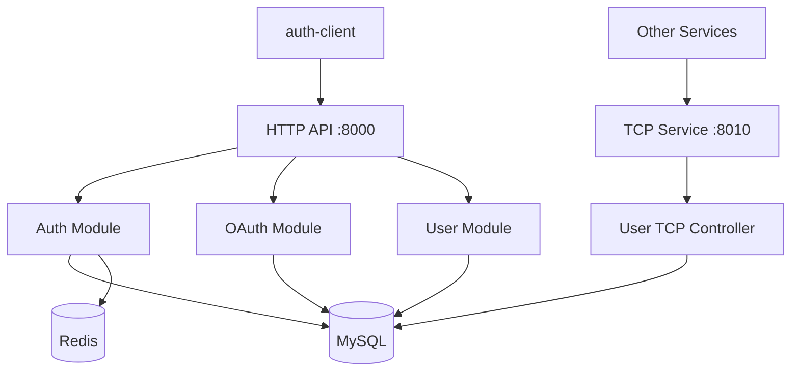

# Auth Server

> KRGeobuk 생태계의 핵심 인증 서비스

krgeobuk 마이크로서비스 생태계의 중앙 인증 서버로, JWT 기반 인증, OAuth 소셜 로그인, 그리고 TCP 마이크로서비스 통신을 제공합니다.

## ✨ 주요 기능

### 🔐 인증 시스템
- **JWT 토큰 관리** - Access/Refresh Token 기반 무상태 인증
- **OAuth 소셜 로그인** - Google, Naver 통합 지원
- **완전한 사용자 관리** - 회원가입, 로그인, 프로필 관리
- **비밀번호 관리** - 찾기/재설정 기능

### 🌐 마이크로서비스 아키텍처
- **HTTP REST API** - 클라이언트 앱을 위한 표준 API (포트 8000)
- **TCP 마이크로서비스** - 서비스 간 고성능 통신 (포트 8010)
- **서비스 디스커버리** - 다른 서비스에서 사용자 정보 조회 가능

### 🛡️ 보안 & 성능
- **HTTP-only 쿠키** - XSS 공격 방지
- **CORS 보안** - 설정된 도메인만 접근 허용
- **Redis 세션 관리** - 고성능 세션 저장소
- **구조화된 로깅** - Winston 기반 모니터링

## 🛠 기술 스택

### Backend Framework
- **NestJS** - 확장 가능한 Node.js 서버 프레임워크
- **TypeScript** - 타입 안전성과 개발 생산성
- **Express** - HTTP 서버 엔진

### Database & Cache
- **MySQL 8** - 관계형 데이터베이스 (포트 3307)
- **Redis** - 인메모리 캐시 및 세션 저장소 (포트 6380)
- **TypeORM** - 객체 관계 매핑 (ORM)

### Integration
- **JWT** - 무상태 인증 토큰
- **OAuth 2.0** - Google, Naver 소셜 로그인
- **TCP Microservices** - 고성능 서비스 간 통신
- **@krgeobuk 패키지** - 공유 라이브러리 생태계

## 🚀 빠른 시작

### 환경 요구사항
- Node.js 18+
- Docker & Docker Compose
- MySQL 8.0+
- Redis 7.0+

### 설치 및 실행
```bash
# 1. 의존성 설치
npm install

# 2. 환경 변수 설정
cp envs/.env.example envs/.env.local
# .env.local 파일에서 실제 값으로 수정

# 3. JWT 키 파일 생성
bash script/generate-jwt-keys.sh

# 4. Docker 인프라 시작 (MySQL + Redis)
npm run docker:local:up

# 5. 개발 서버 시작
npm run start:debug
```

서버가 다음 포트에서 실행됩니다:
- **HTTP API**: http://localhost:8000
- **TCP Service**: localhost:8010
- **Swagger Docs**: http://localhost:8000/api/docs

### 주요 환경 변수
```bash
# 서버 설정
NODE_ENV=development
PORT=8000
TCP_PORT=8010
APP_NAME=auth-server

# 클라이언트 URL
AUTH_CLIENT_URL=http://localhost:3000
PORTAL_CLIENT_URL=http://localhost:3200

# MySQL 데이터베이스
MYSQL_HOST=auth-mysql
MYSQL_PORT=3306              # 컨테이너 내부 포트
MYSQL_OPEN_PORT=3307         # 외부 접근 포트
MYSQL_USER=krgeobuk
MYSQL_PASSWORD=your-mysql-password
MYSQL_DATABASE=auth

# Redis 캐시
REDIS_HOST=auth-redis
REDIS_PORT=6379              # 컨테이너 내부 포트
REDIS_OPEN_PORT=6380         # 외부 접근 포트
REDIS_PASSWORD=your-redis-password

# JWT 키 파일 (generate-jwt-keys.sh로 생성)
JWT_ACCESS_PRIVATE_KEY_PATH=./keys/access-private.key
JWT_ACCESS_PUBLIC_KEY_PATH=./keys/access-public.key
JWT_REFRESH_PRIVATE_KEY_PATH=./keys/refresh-private.key
JWT_REFRESH_PUBLIC_KEY_PATH=./keys/refresh-public.key
JWT_ACCESS_EXPIRES_IN=15m
JWT_REFRESH_EXPIRES_IN=7d

# Google OAuth
GOOGLE_CLIENT_ID=your-google-client-id.apps.googleusercontent.com
GOOGLE_CLIENT_SECRET=your-google-client-secret

# Naver OAuth
NAVER_CLIENT_ID=your-naver-client-id
NAVER_CLIENT_SECRET=your-naver-client-secret
```

## 🏗️ 아키텍처

### 서비스 구조


### 프로젝트 구조
```
src/
├── modules/                # 기능 모듈
│   ├── auth/              # JWT 인증 관리
│   ├── oauth/             # Google/Naver OAuth
│   └── user/              # 사용자 관리 (HTTP + TCP)
├── common/                # 공통 기능
│   ├── jwt/               # JWT 토큰 서비스
│   └── utils/             # 유틸리티 함수
├── config/                # 환경 설정
├── database/              # 데이터베이스 연결
│   ├── mysql/             # TypeORM 설정
│   └── redis/             # Redis 설정
└── main.ts                # 애플리케이션 진입점
```

## 📡 API 문서

### HTTP REST API

#### 인증 엔드포인트
```bash
POST /api/auth/login           # 로그인
POST /api/auth/signup          # 회원가입
POST /api/auth/logout          # 로그아웃
POST /api/auth/refresh         # 토큰 갱신
POST /api/auth/forgot-password # 비밀번호 찾기
POST /api/auth/reset-password  # 비밀번호 재설정
```

#### OAuth 엔드포인트
```bash
GET /api/oauth/login-google    # Google 로그인 시작
GET /api/oauth/callback/google # Google 콜백
GET /api/oauth/login-naver     # Naver 로그인 시작
GET /api/oauth/callback/naver  # Naver 콜백
```

#### 사용자 관리
```bash
GET    /api/user/profile       # 프로필 조회
PUT    /api/user/profile       # 프로필 수정
DELETE /api/user/account       # 계정 삭제
POST   /api/user/verify-email  # 이메일 인증
```

### TCP 마이크로서비스 API

다른 서비스에서 사용자 정보를 조회할 때 사용:

```typescript
// 서비스 간 TCP 통신 예시
const user = await client.send('user.findById', { userId }).toPromise();
const users = await client.send('user.findByIds', { userIds }).toPromise();
const exists = await client.send('user.exists', { userId }).toPromise();
```

### 사용 가능한 TCP 패턴
| 패턴 | 설명 | 요청 | 응답 |
|------|------|------|------|
| `user.findById` | ID로 사용자 조회 | `{ userId: string }` | `User \| null` |
| `user.findByEmail` | 이메일로 조회 | `{ email: string }` | `User \| null` |
| `user.findByIds` | 여러 사용자 조회 | `{ userIds: string[] }` | `User[]` |
| `user.exists` | 존재 여부 확인 | `{ userId: string }` | `boolean` |

## 📦 스크립트

### 개발
```bash
npm run start:debug     # 개발 서버 (nodemon)
npm run build          # TypeScript 빌드
npm run build:watch    # 감시 모드 빌드
```

### 코드 품질
```bash
npm run lint           # ESLint 검사
npm run lint-fix       # ESLint 자동 수정
npm run format         # Prettier 포맷팅
```

### 테스트
```bash
npm run test           # 단위 테스트
npm run test:watch     # 감시 모드 테스트
npm run test:cov       # 커버리지 테스트
npm run test:e2e       # E2E 테스트
```

### Docker 운영
```bash
npm run docker:local:up    # 로컬 환경 시작
npm run docker:dev:up      # 개발 환경 시작
npm run docker:prod:up     # 프로덕션 환경 시작
npm run docker:local:down  # 환경 중지
```

## 🐳 Docker 배포

### 로컬 개발 환경
```bash
# 전체 스택 시작 (MySQL + Redis + App)
npm run docker:local:up

# 개별 서비스 접근
docker-compose logs auth-server  # 애플리케이션 로그
docker-compose logs mysql        # 데이터베이스 로그
```

### 프로덕션 배포
```bash
# 프로덕션 환경으로 배포
npm run docker:prod:up

# 환경별 설정 파일
# - docker-compose.yml (기본)
# - docker-compose.dev.yml (개발)
# - docker-compose.prod.yml (프로덕션)
```

## 🔗 서비스 연동

### 다른 서비스에서 auth-server 사용

```typescript
// authz-server에서 사용 예시
@Injectable()
export class RoleService {
  constructor(
    @Inject('AUTH_SERVICE') private authClient: ClientProxy
  ) {}

  async getUsersByRole(roleId: string) {
    const userIds = await this.getRoleUserIds(roleId);
    
    // auth-server TCP로 사용자 정보 조회
    const users = await this.authClient
      .send('user.findByIds', { userIds })
      .toPromise();
      
    return users;
  }
}
```

### 클라이언트 설정
```typescript
// 다른 서비스의 app.module.ts
ClientsModule.register([
  {
    name: 'AUTH_SERVICE',
    transport: Transport.TCP,
    options: {
      host: 'auth-server',  // Docker 네트워크
      port: 8010,
    },
  },
])
```

## 📊 모니터링 & 로깅

### 로그 구조
```bash
logs/
├── app-2024-01-01.log      # 애플리케이션 로그
├── error-2024-01-01.log    # 에러 로그
└── combined.log            # 통합 로그
```

### 주요 메트릭
- **인증 성공/실패율**
- **토큰 발급/갱신 빈도**  
- **OAuth 로그인 통계**
- **TCP 서비스 응답 시간**

## 🤝 기여하기

1. 이 레포지토리를 Fork
2. feature 브랜치 생성 (`git checkout -b feature/amazing-feature`)
3. 변경사항 커밋 (`git commit -m 'Add some amazing feature'`)
4. 브랜치에 Push (`git push origin feature/amazing-feature`)
5. Pull Request 생성

### 개발 가이드라인
- [CLAUDE.md](./CLAUDE.md) 개발 표준 준수
- ESLint + Prettier 코드 스타일 적용
- 단위 테스트 작성 필수
- API 변경 시 Swagger 문서 업데이트

## 📄 라이선스

이 프로젝트는 MIT 라이선스 하에 배포됩니다.

---

**KRGeobuk Auth Server** - 안전하고 확장 가능한 인증 서비스

© 2024 KRGeobuk. All rights reserved.
